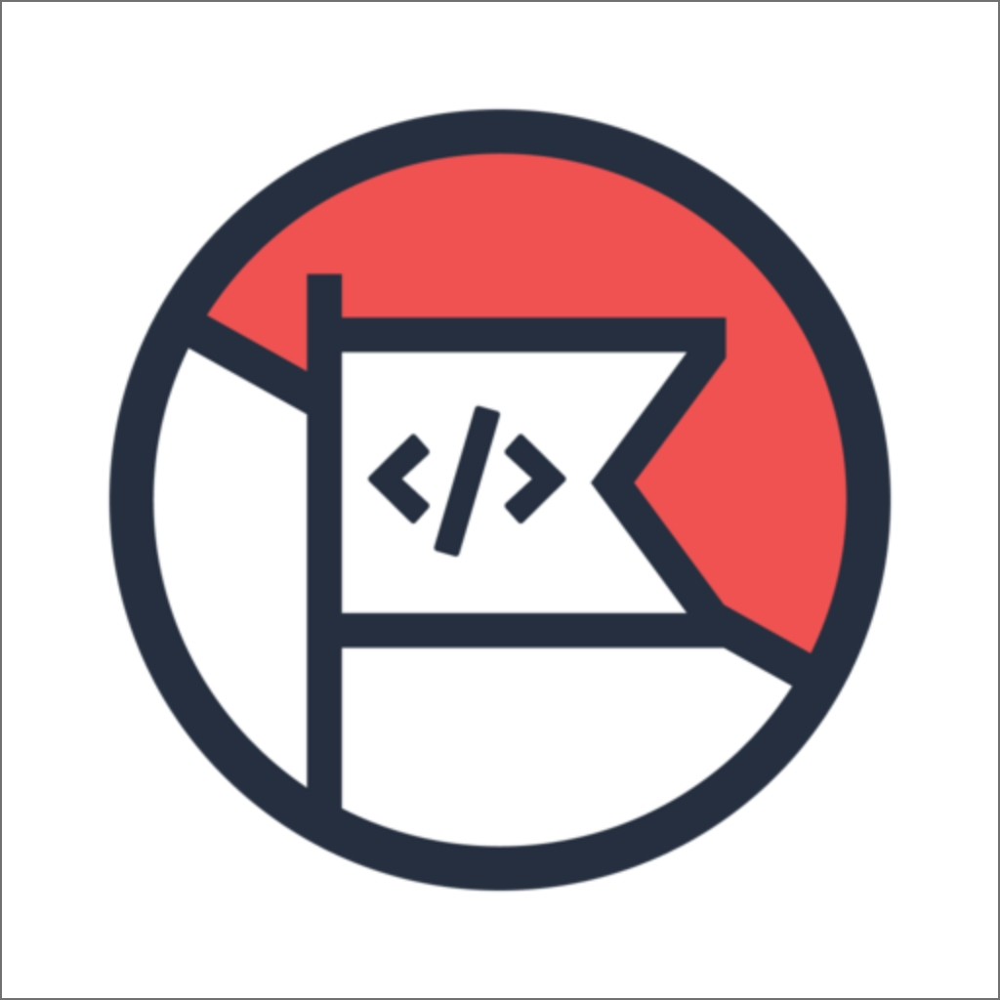

<p align="center">
  <a href="https://www.pejuangkode.com">
    
  </a>
</p>
<h1 align="center">
  Pejuang Kode
</h1>

## Selamat datang

Pejuang Kode adalah wadah belajar bersama dengan beragam topik bahasan mulai dari pemrograman, karir, hingga keluarga.

## Ruang diskusi

Sebagai sarana untuk membangun pengetahuan bersama, kami memiliki ruang diskusi di Discord [Pejuang Kode](https://discord.gg/n2Pm2s7)

## Mengembangkan di `localhost`

Disarankan untun menggunakan [Node.js](https://nodejs.org/en/) versi >= 12.0.0 dengan [yarn](https://yarnpkg.com/) sebagai _package manager_.

```bash
# instal pustaka/dependensi
yarn

# jalankan secara lokal di `localhost:3000`
yarn dev

# buat _production build_
yarn build
```

## Berkontribusi

Kami menerima _pull requests_ dari siapapun! Silakan membaca [Panduan Berkontribusi](KONTRIBUSI.md) untuk informasi lebih lanjut.

## Credits

- Dibuat dengan [Next.js](https://nextjs.org/).
- Menggunakan [TailwindCSS](https://tailwindcss.com/).
